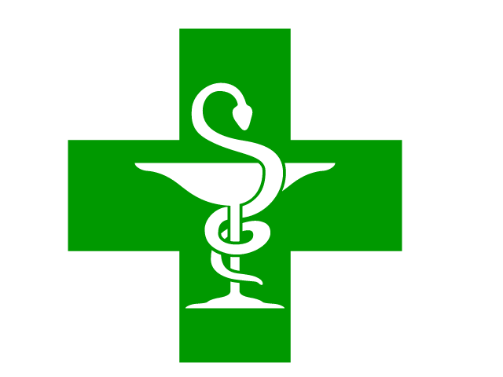

    
  </a>

<h1 align="center">
  Parole de pharmacienne
</h1>

Welcome to Parole de pharmacienne, a blog that I've made for a client who is a pharmacist and needed to display regularly posts about health, beauty, and nutrition. Those 3 topics are either advices or news.
My client is going to use the CMS netlify to publish regularly.
I've used Gatsby Starter Blog to build this site and then I got inspiration from many different websites to build something great. I've used bootsrap

## 🍁🍁 Stack used for this website

1.  **GatsbyJS**
    

1.  **Bootsrap**
    

1.  **Netlify CMS**
    
